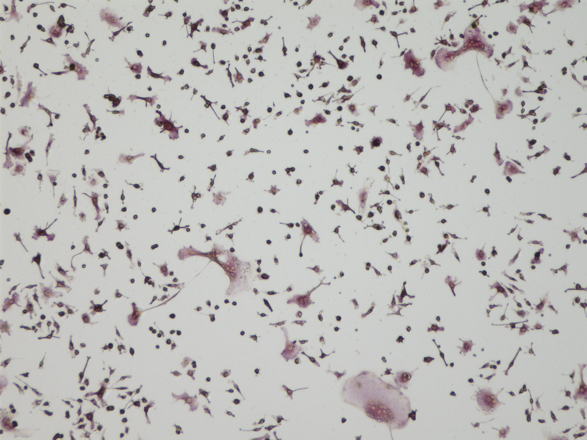
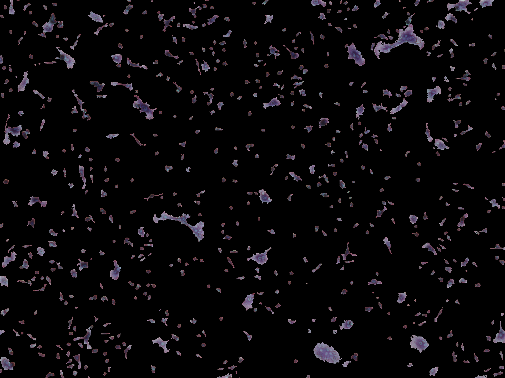
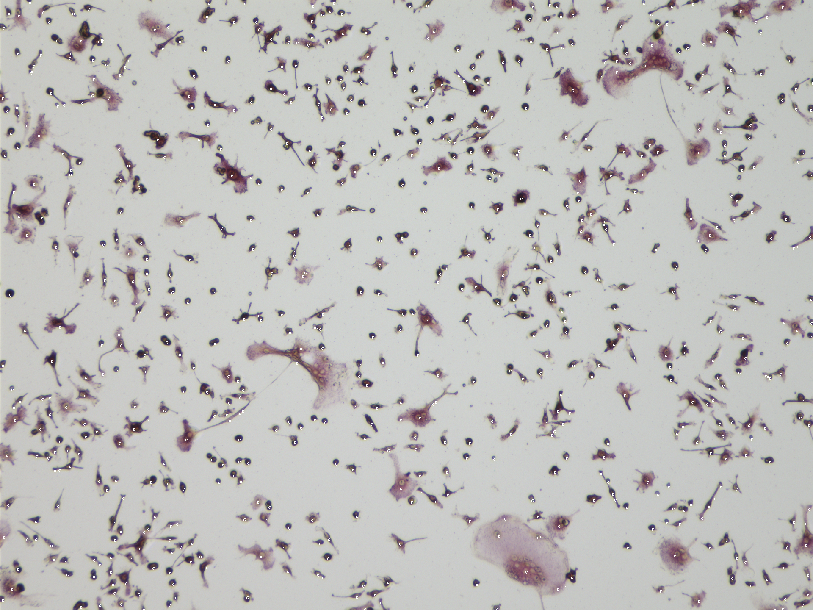
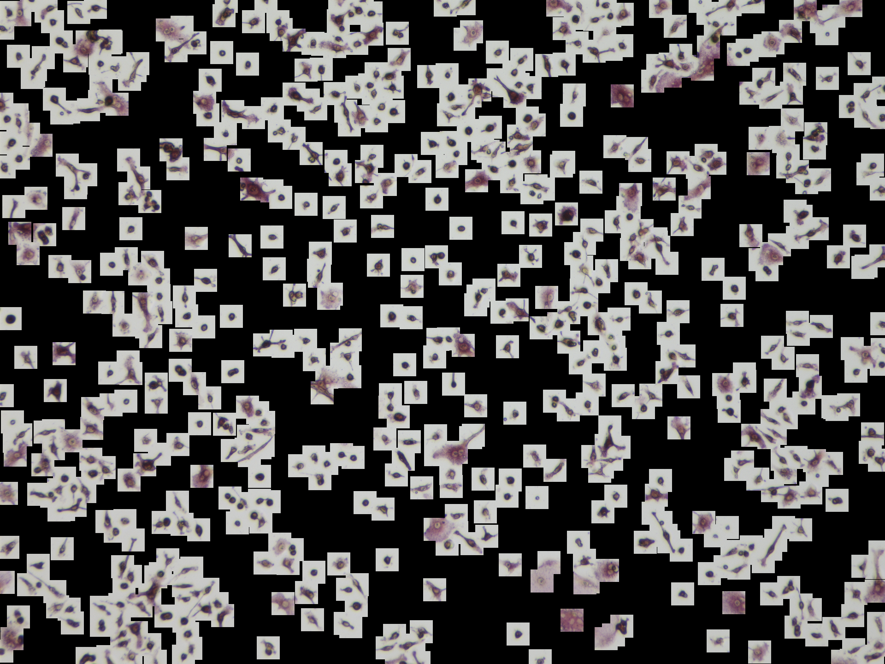
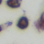

# Cell Segmentation and Classification Project

## Protocol

### 1 Resize Image

If user gives our program with different resolution of images, you can specify the resize size of input image to make your input agrees well with our input.   
Our resolution: 50 pixels are equivalent to 38um.     
Here is an example of our input：   



### 2 Segmentation

Use the [watershed idea](https://docs.opencv.org/master/d3/db4/tutorial_py_watershed.html) introduced in OpenCV to do segmentation.
This is our watershed results:  

After the segmentation, the extracted area used for prediction are shown below.


### 3 Classification

We use our trained classifiction model to make predictions for the segmented input.   

#### 3.1 Input Center Location
To make our segmented area as our classification input, we use the center of the segmented area as the center of square for input.
Here is the example of our center location (We use "C" to locate the center for each segmentation area):


#### 3.2 Input Square Extraction
Based on the given center, we then have the input for our classification model:

Here is an example of one input square:


#### 3.3 Prediction
Based on the given square, our prediction model- ResNet20 will predict label for each input.   
Here is an example of prediction:


## Code Pre-required Library
```
Pillow: pip3 install Pillow==6.2.2
numpy: pip3 install numpy==1.18.2
pandas: pip3 install pandas==1.0.3
OpenCv: pip3 install opencv-python==4.1.2
matplotlib: pip3 install matplotlib==3.2.1
PYtorch: pip3 install torch==1.1.0
```
### 1 Install dependency in a faster way:
```
pip3 install -r requirments.txt
```
### 2 Install them one by one with pip command listed above.

## Usage
```
python3 main.py -h

  -h, --help            show this help message and exit
  -F F                  Input cell image
  --mode MODE           mode 6 is used for segmentation+prediction with our trained model
  --type TYPE           setting type: 0: common setting, 1: including large
                        cells
  --choose CHOOSE       gpu id choose for training
  --batch_size BATCH_SIZE
                        batch size for prediction, default=256
  -M M                  trained model path
  --width WIDTH         Width of classification image, default=50
  --height HEIGHT       Height of classification image, default=50
  --num_workers NUM_WORKERS
                        number of workers for the dataloader, default=4
  --resize RESIZE       if we need resize the input to make the input agrees with our resolution: 50 pixels are equivalent to 38um.
  --resize_height RESIZE_HEIGHT
                        The required image height used for the segmentation
  --resize_width RESIZE_WIDTH
                        The required image width used for the segmentation
  --filter_size FILTER_SIZE
                        user can adjust their own filter size to have
                        different segmentation results
  --threshold THRESHOLD
                        Threshold used to do image segmentation (Suggested 150-210 for big cell cases)
```

### 1 Classification
Give an image and location txt file, then our model will give predictions whether it's negative or positive.
```
python3 main.py --mode=2 -F=[Img_path] -F1=[Location_txt_file] -M=[Model_path] --choose=[gpu_id] --class=2 --height=50 --width=50
```
We kept our trained model in "Best_Model" directory, you can specify the path for -M parameter, --choose Specify the gpu id, default:0, for cpu version user, please use -1. Our prediction results will kept in "Predict_Result" direcotry (Automatically generated).

### 2 Segmentation + Classification
Give an image, our program will automatically do the segmentation and classification.
```
python3 main.py --mode=6 -F=[Img_path] -M=[Model_path] --choose=[gpu_id] --type=[1 or 0] --filter_size=[filter_size] --threshold=[threshold_level] --resize=[1 or 0] --resize_height=[resize_height] --resize_width=[resize_width] --class=2 --height=50 --width=50 
```
We kept our trained model in "Best_Model" directory, you can specify the path for -M parameter. Our prediction results will kept in "Predict_Result" directory (Automatically generated).

Parameter Explanation:    
--choose Specify the gpu id, default:0, for cpu version user, please use -1.
--type is used for specify your condition, 0 is for common setting, while 1 is for image with large cells.        
--resize resize flag for situation we need to resize because the input image resolution is different. 1 denotes resize while 0 forbid resize function.   
--resize_height --resize_weight resized image height and width, calculated based on our resolution. The resized image resolution should be 50 pixels are equivalent to 38um.   

Those parameters only for --type=1 (image with large cells)    
--filter_size specifies your filter for segmentation, usually we choose an integer value in range [1,10].     
--threshold specifies your threshold for segmentation, usually we choose an integer value in range [150,210].   

## Download Code
To use this code on your own machine, please clone the repo by
```
git clone [repo_path]
```


